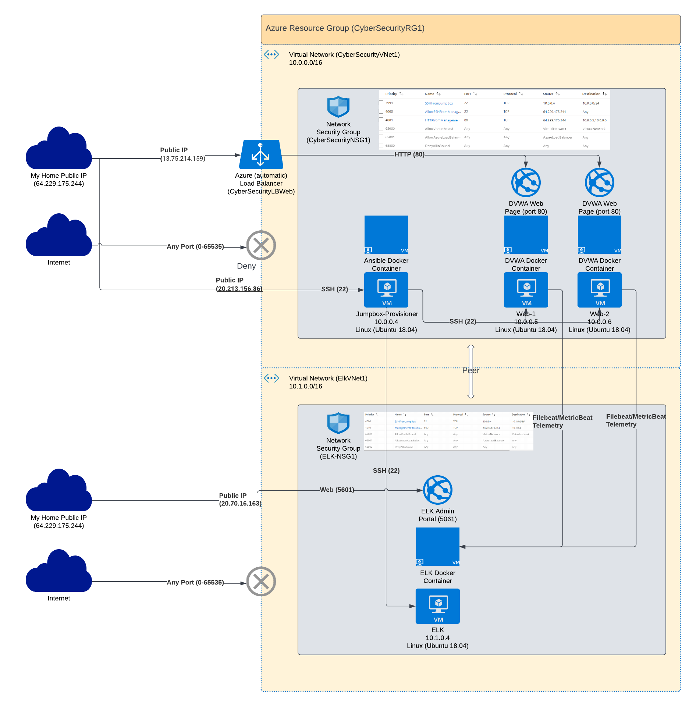

## Automated ELK Stack Deployment

The files in this repository were used to configure the network depicted below.

**Note**: The following image link needs to be updated. Replace `diagram_filename.png` with the name of your diagram image file.  

These files have been tested and used to generate a live ELK deployment on Azure. They can be used to either recreate the entire deployment pictured above. Alternatively, select portions of the -Ansible YAML playbook- file may be used to install only certain pieces of it, such as Filebeat.

This document contains the following details:
- Description of the Topology
- Access Policies
- ELK Configuration
  - Beats in Use
  - Machines Being Monitored
- How to Use the Ansible Build

### Description of the Topology

The main purpose of this network is to expose a load-balanced and monitored instance of DVWA, the D*mn Vulnerable Web Application.

Load balancing ensures that the application will be highly -available-, in addition to restricting -access- to the network.
- _TODO: What aspect of security do load balancers protect? What is the advantage of a jump box?_

Load balancers ensure high availability of a set of servers so that if one were to have problems or undergoing maintenance, you could direct
traffic to another instance of the same application. Also, balancing the traffic between two servers will help to ensure that you aren't hitting 
any resource limits. 

The advantage of a jump box is that you are not exposing your entire network and servers to the outside world. Instead, each machine is only reachable 
from that jump box and leaves the other systems less exposed to exploits or brute force attempts.

Integrating an ELK server allows users to easily monitor the vulnerable VMs for changes to the -application- and system -logs- .
- _TODO: What does Filebeat watch for?_
File beat monitors log files, including system files, for changes

- _TODO: What does Metricbeat record?_
Metric beat provides telemetry data from applications such as CPU usage, memory usage, IO, etc.

The configuration details of each machine may be found below.
_Note: Use the [Markdown Table Generator](http://www.tablesgenerator.com/markdown_tables) to add/remove values from the table_.

| Name                | Function                                  | IP Address | Operating System      |
|---------------------|-------------------------------------------|------------|-----------------------|
| Jumpbox-Provisioner | Management Gateway Ansible Container Host | 10.0.0.4   | Linux (Ubuntu 18.04)  |
| Web-1               | DVWA Container Host                       | 10.0.0.5   | Linux (Ubuntu 18.04)  |
| Web-2               | DVWA Container Host                       | 10.0.0.6   | Linux (Ubuntu 18.04)  |
| ELK                 | Elk Container Host                        | 10.1.0.4   | Linux (Ubuntu 18.04)  |

### Access Policies

The machines on the internal network are not exposed to the public Internet. 

Only the -Jumpbox-Provisioner- machine can accept connections from the Internet. Access to this machine is only allowed from the following IP addresses:
- _TODO: Add whitelisted IP addresses_
64.229.175.244

Machines within the network can only be accessed by -the Ansible container running on the Jumpbox-Provisioner-.
- _TODO: Which machine did you allow to access your ELK VM? What was its IP address?_
I allowed access from the Ansible container running on the Jumpbox-Provisioner using SSH. It's IP address was 10.0.0.4.

A summary of the access policies in place can be found in the table below.

| Name         | Service    | Publicly Accessible                           | Allowed IP Addresses |
|--------------|------------|-----------------------------------------------|----------------------|
| Jump Box     | SSH        | Yes - but only available to my home public IP | 64.229.175.244       |
| Web-1, Web-2 | HTTP       | Yes - but only available to my home public IP | 64.229.175.244       |
| Web-1, Web-2 | SSH        | No                                            | 10.0.0.4             |
| Elk          | 5601 (Web) | Yes - but only available to my home public IP | 64.229.175.244       |
| Elk          | SSH        | No                                            | 10.0.0.4             |

### Elk Configuration

Ansible was used to automate configuration of the ELK machine. No configuration was performed manually, which is advantageous because...
- _TODO: What is the main advantage of automating configuration with Ansible?_

As new servers are added, you can quickly deploy the configuration. Also, the configuration can be exactly replicated without any possibility of human error
if a step is missed. Automating deployments means that you can quickly deploy configuration to multiple machines very quickly.

The playbook implements the following tasks:
- _TODO: In 3-5 bullets, explain the steps of the ELK installation play. E.g., install Docker; download image; etc._

1. Install docker.io
2. Install python3-pip
3. Install Docker module
4. Increase virtual memory
5. Download and launch a Docker Elk container
6. Enable service docker on boot

The following screenshot displays the result of running `docker ps` after successfully configuring the ELK instance.

**Note**: The following image link needs to be updated. Replace `docker_ps_output.png` with the name of your screenshot image file.  

### Target Machines & Beats
This ELK server is configured to monitor the following machines:
- _TODO: List the IP addresses of the machines you are monitoring_

Web-1 - 10.0.0.5
Web-2 - 10.0.0.6

We have installed the following Beats on these machines:
- _TODO: Specify which Beats you successfully installed_
Filebeats:
System logs

Metricbeats:
Docker logs

These Beats allow us to collect the following information from each machine:
- _TODO: In 1-2 sentences, explain what kind of data each beat collects, and provide 1 example of what you expect to see. E.g., `Winlogbeat` collects Windows logs, which we use to track user logon events, etc._

Filebeats collect parse information from specific log files in order to provide chartable telemetry data. For example, installing and enabling the 
Apache Filebeat module will allow you to parse logs specific to apache such as incoming HTTP connections, submitted forms, etc.

Metricbeats collect metrics from the operating system and running services in order to generate data. For example. installing the MSSQL module 
on a Windows SQL server will collect telemetry data such as IO, CPU and memory, and performance statistics.

### Using the Playbook
In order to use the playbook, you will need to have an Ansible control node already configured. Assuming you have such a control node provisioned: 

SSH into the control node and follow the steps below:
- Copy the -YAML playbook- file to -the ansible container.
- Update the -/etc/ansible/hosts- file to include -each of the hosts that you want to run the playbook against. Be sure to create groups depending on what playbooks you're running-
- Run the playbook, and navigate to - [http://ELK-IP:5601] - to check that the installation worked as expected.

_TODO: Answer the following questions to fill in the blanks:_
- _Which file is the playbook? Where do you copy it?_
- _Which file do you update to make Ansible run the playbook on a specific machine? How do I specify which machine to install the ELK server on versus which to install Filebeat on?_
- _Which URL do you navigate to in order to check that the ELK server is running?

_As a **Bonus**, provide the specific commands the user will need to run to download the playbook, update the files, etc._

